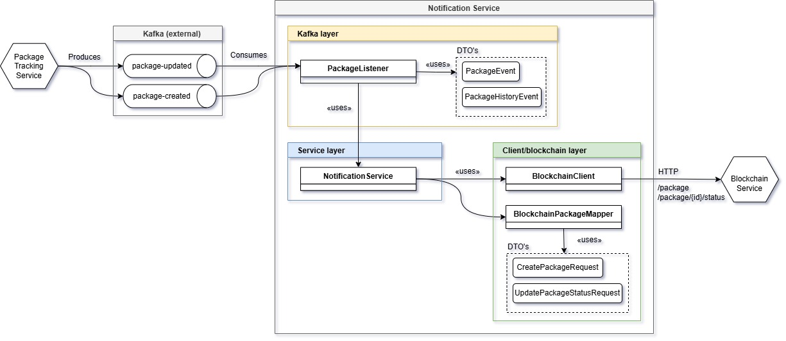

# Notification Service

[](https://github.com/amollrod/notification-service/actions/workflows/pipeline.yml)
[](https://www.gnu.org/licenses/gpl-3.0.html)
[](https://creativecommons.org/licenses/by-nc/3.0/es/)

Este microservicio se encarga de gestionar el envío de notificaciones relacionadas con los paquetes registrados en el sistema. Escucha eventos provenientes del `package-tracking-service` a través de Kafka y los registra en la blockchain utilizando el `blockchain-service`.



## Tecnologías utilizadas

* Java 17
* Spring Boot 3
* Apache Kafka
* REST Template
* Web3j (a través del `blockchain-service`)
* JUnit, Mockito, Testcontainers
* Docker, Docker Compose

---

## Responsabilidad del microservicio

Este microservicio escucha eventos de creación y actualización de paquetes desde un topic Kafka y se encarga de enviar la información relevante a la blockchain. Utiliza un cliente REST para comunicarse con el `blockchain-service`, transformando los eventos en solicitudes adecuadas según el estado del paquete.

---

## Estructura del proyecto

```
notification-service/
├── Dockerfile
├── pom.xml
├── README.md
├── .github/workflows/
│   ├── build.yml
│   ├── docker-publish.yml
│   ├── integration-tests.yml
│   ├── pipeline.yml
│   └── unit-tests.yml
├── src/
│   ├── main/
│   │   ├── java/com/tfg/notification/
│   │   │   ├── NotificationApplication.java
│   │   │   ├── clients/blockchain/
│   │   │   │   ├── BlockchainClient.java
│   │   │   │   ├── BlockchainClientConfig.java
│   │   │   │   ├── dto/
│   │   │   │   │   ├── CreatePackageRequest.java
│   │   │   │   │   └── UpdatePackageStatusRequest.java
│   │   │   │   └── mappers/BlockchainPackageMapper.java
│   │   │   ├── event/
│   │   │   │   ├── PackageEvent.java
│   │   │   │   └── PackageHistoryEvent.java
│   │   │   ├── kafka/PackageListener.java
│   │   │   └── services/NotificationService.java
│   │   └── resources/
│   │       ├── application.properties
│   │       ├── application-docker.properties
│   │       └── application-local.properties
│   └── test/java/com/tfg/notification/
│       ├── ArchitectureTest.java
│       ├── clients/blockchain/BlockchainClientTest.java
│       ├── kafka/
│       │   ├── PackageEventDeserializationTest.java
│       │   └── PackageListenerIT.java
│       └── services/NotificationServiceTest.java
```

---

## Funcionamiento

1. **Kafka Listener**: `PackageListener` escucha los eventos `package-created` y `package-updated` provenientes del topic Kafka.
2. **Transformación del Evento**: los eventos son objetos `PackageEvent` que contienen información sobre el ID del paquete, estado, localización y timestamp.
3. **Notificación a Blockchain**: mediante el `BlockchainClient`, se transforma el evento en una petición REST y se invoca al `blockchain-service`:

    * Si el paquete aún no existe, se utiliza `CreatePackageRequest`
    * Si el paquete ya existe, se utiliza `UpdatePackageStatusRequest`
4. **Mapper**: `BlockchainPackageMapper` convierte el `PackageEvent` en el DTO adecuado según el caso.

---

## Despliegue

El servicio puede iniciarse en local o mediante Docker:

```bash
# Local
./mvnw spring-boot:run

# Docker
docker build -t notification-service .
docker run -p 8081:8081 notification-service
```

También forma parte del ecosistema orquestado mediante `docker-compose`.

---

## Testing

El proyecto incluye:

* Tests unitarios: `NotificationServiceTest`, `BlockchainClientTest`
* Tests de integración: `PackageListenerIT`, `PackageEventDeserializationTest`
* Test de arquitectura: `ArchitectureTest` usando ArchUnit

---

## CI/CD

GitHub Actions está configurado con:

* build.yml
* unit-tests.yml
* integration-tests.yml
* docker-publish.yml
* pipeline.yml

---

## Licencias

* Este repositorio está licenciado bajo los términos de la [GNU General Public License v3.0](./LICENSE)
* La memoria del TFG está protegida bajo: [CC BY-NC 3.0 España](https://creativecommons.org/licenses/by-nc/3.0/es/) y [GNU Free Documentation License 1.3](https://www.gnu.org/licenses/fdl-1.3.html)

Proyecto desarrollado como parte del TFG de **Alex Moll Rodríguez** para la **UOC** en 2025.